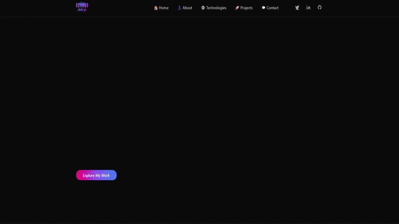

# Porto - Professional Portfolio Template

## Project Name
**Porto** - A Modern React-Based Portfolio Template for Developers

---

## Livepreview
https://diskandar-ylporto.netlify.app

## Reason for Creation

Porto was developed to provide developers with a professional, customizable, and production-ready portfolio template. The objective is to eliminate the need for developers to build their portfolios from scratch while maintaining full control over content, design, and deployment. This template showcases professional work experience, educational background, technical skills, and projects through a responsive, modern interface with smooth animations and dark mode support.

---

## 🎨 Web Preview

Get a glimpse of Porto in action! This preview showcases the complete website experience across all pages.

<div align="center">
  
  
  ### Featured Pages in Preview:
  ✨ **Home** - Hero section with animated introduction  
  👤 **About** - Work experience and education timeline  
  🚀 **Projects** - Interactive project portfolio grid  
  ⚙️ **Technologies** - Tech stack and development tools  
  💬 **Contact** - Contact information and links
</div>

---

## Key Features

- **Single-Page Application (SPA)** with client-side routing using React Router v6
- **Responsive Design** optimized for mobile, tablet, and desktop viewports
- **Dark Mode Support** built-in with Tailwind CSS custom theme
- **Smooth Animations** powered by GSAP (GreenSock Animation Platform)
- **Centralized Content Management** via single `Details.js` source of truth
- **Customizable Branding** with gradient logo and personal styling
- **Professional Sections**: Home, About, Projects, Technologies, and Contact
- **SEO-Optimized** with semantic HTML and accessibility features
- **Modern Dark Aesthetic** inspired by Instagram's design philosophy
- **Interactive Elements** with hover effects and smooth transitions

---

## Tech Stack

| Technology | Purpose |
|-----------|---------|
| **React 18** | Frontend framework |
| **React Router v6** | Client-side navigation |
| **Tailwind CSS v3** | Utility-first styling with dark mode |
| **GSAP** | Advanced animations |
| **PostCSS** | CSS processing and optimization |

---

## Installation

### Prerequisites
- Node.js (v14 or higher)
- npm or yarn package manager

### Setup Instructions

1. **Clone the repository**
   ```bash
   git clone <repository-url>
   cd porto
   ```

2. **Install dependencies**
   ```bash
   npm install
   ```

3. **Start the development server**
   ```bash
   npm start
   ```
   The application will open at `http://localhost:3000`

---

## How to Use

### 1. Customizing Content

All portfolio content is centralized in `src/Details.js`. Update the following exports:

- **`personalDetails`**: Your name, tagline, biography, and profile image
- **`workDetails`**: Array of work experiences with position, company, location, type, and duration
- **`eduDetails`**: Educational background and certifications
- **`projectDetails`**: Portfolio projects with title, description, tech stack, and links
- **`techStackDetails`**: Technologies and tools you work with
- **`socialMediaUrl`**: Links to LinkedIn, GitHub, Twitter, Instagram
- **`contactDetails`**: Email and phone number

### 2. Updating Assets

Place your assets in the appropriate folders:
- **Profile image**: `src/assets/profile.jpg`
- **Project images**: `src/assets/projects/project1.jpg`, etc.
- **Tech stack icons**: `src/assets/techstack/` (PNG/SVG format)

### 3. Modifying Branding

- **Gradient Logo**: Edit `src/assets/logo.svg` to adjust colors and design
- **White Logo**: Customize `src/assets/logo2.svg` for light backgrounds
- **Color Theme**: Modify Tailwind configuration in `tailwind.config.js`

### 4. Navigation Structure

The application includes five main routes (defined in `src/App.js`):
- `/` - Home page with hero section
- `/about` - Work experience and education timeline
- `/projects` - Portfolio project grid
- `/technologies` - Tech stack and development tools
- `/contact` - Contact information and links

### 5. Deploying the Website

```bash
npm build
```

This generates a production-ready build in the `build/` folder. Deploy to:
- **Netlify**: Use `public/_redirects` for SPA routing support
- **Vercel**: Automatic detection and deployment
- **GitHub Pages**: Configure for static hosting

---

## How to Test

### 1. Manual Testing

**Browser Testing:**
```bash
npm start
```
- Navigate through all five routes using the header navigation
- Test mobile menu toggle on devices under 768px width
- Verify dark mode toggle (Tailwind dark mode class on root element)
- Check all external links (projects, social media, emails)

**Responsiveness:**
- Test on mobile (320px), tablet (768px), and desktop (1024px+)
- Verify layout adjustments with browser DevTools

**Dark Mode:**
- Toggle dark mode by adding `dark` class to the HTML element
- Verify all colors contrast properly with both light and dark backgrounds

### 2. Automated Testing

Run the test suite:
```bash
npm test
```

This launches Jest and React Testing Library for component and integration tests.

### 3. Build Testing

Verify the production build:
```bash
npm build
npm install -g serve
serve -s build
```

Open `http://localhost:3000` and verify the production build performs correctly.

### 4. Performance Audit

Use Google Chrome DevTools Lighthouse:
1. Open DevTools (F12)
2. Navigate to Lighthouse tab
3. Run audit for Performance, Accessibility, Best Practices, and SEO
4. Address any warnings or errors

### 5. Content Validation

- Verify all text renders correctly without overflow
- Check image loading times and quality
- Validate external links are functional
- Test contact email and phone links work on target devices

### 6. Browser Compatibility

Test on multiple browsers:
- Chrome/Edge (v90+)
- Firefox (v88+)
- Safari (v14+)
- Mobile browsers (iOS Safari, Android Chrome)

### 7. Generate Preview GIF

To create an animated preview of your portfolio:

**Prerequisites:**
```bash
npm install puppeteer gif-encoder sharp
```

**Generate the preview:**
```bash
node create-preview-gif.js
```

This will capture screenshots of all pages and create a `preview.gif` file in your project root. The GIF automatically cycles through:
- Home page with hero section
- About page with timeline
- Projects page with portfolio grid
- Technologies page with tech stack
- Contact page with information

**Customize the preview** by editing `create-preview-gif.js`:
- Adjust `FRAME_WIDTH` and `FRAME_HEIGHT` for different sizes
- Modify `FRAME_DELAY` to change animation speed
- Update the `PAGES` array to include/exclude specific pages

---

## Project Structure

```
porto/
├── public/
│   ├── index.html
│   └── _redirects              # SPA routing for Netlify
├── src/
│   ├── assets/
│   │   ├── logo.svg            # Gradient logo (dark)
│   │   ├── logo2.svg           # White logo (light)
│   │   ├── profile.jpg         # Your profile image
│   │   ├── projects/           # Project preview images
│   │   ├── techstack/          # Technology icons
│   │   └── ui/                 # UI assets
│   ├── Components/
│   │   ├── Header.js           # Navigation header
│   │   ├── Footer.js           # Footer section
│   │   ├── Project.js          # Project card component
│   │   └── Work.js             # Work/education card component
│   ├── Pages/
│   │   ├── Home.js             # Hero section with animations
│   │   ├── About.js            # Work experience & education
│   │   ├── Contact.js          # Contact information
│   │   ├── Projects.js         # Portfolio projects grid
│   │   └── Technologies.js     # Tech stack showcase
│   ├── App.js                  # Main app component with routes
│   ├── Details.js              # Centralized content source
│   ├── index.js                # React entry point
│   └── index.css               # Global styles
├── package.json                # Dependencies and scripts
├── tailwind.config.js          # Tailwind CSS configuration
├── postcss.config.js           # PostCSS setup
└── README.md                   # Project documentation
```

---

## Configuration

### Tailwind CSS

Modify `tailwind.config.js` to customize:
- Color palette
- Spacing and sizing
- Breakpoints
- Typography

### PostCSS

`postcss.config.js` handles CSS processing with Tailwind CSS and autoprefixer.

---

## Best Practices

1. **Content Updates**: Edit only `src/Details.js` for portfolio changes
2. **Image Optimization**: Compress images before adding to assets folder
3. **Dark Mode**: Test all custom colors with dark mode variants
4. **Accessibility**: Ensure all images have descriptive alt text
5. **Links**: Always use `target="_blank" rel="noopener noreferrer"` for external links

---

## Deployment Checklist

- [ ] Update `personalDetails` with your information
- [ ] Replace profile image with your photo
- [ ] Add project images and descriptions
- [ ] Update social media URLs
- [ ] Customize primary colors in Tailwind config
- [ ] Test all routes and links
- [ ] Verify dark mode functionality
- [ ] Check responsive design on mobile
- [ ] Run Lighthouse audit
- [ ] Deploy to hosting platform

---

## Support & Customization

For additional customization:
- Modify component styles in the className attributes
- Extend Tailwind theme in `tailwind.config.js`
- Add new routes by editing `src/App.js` and creating new page components
- Enhance animations by modifying GSAP timelines in component files

---

## License

This project is created by **Diskandar-YL** with ❤️ for the development community.

---

**Last Updated**: February 24, 2026
